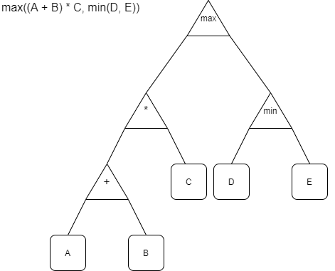

# Mathematical Expression Parser

The Mathematical Expression Parser is a simple parser to convert Mathematical
Expressions written as a string, to Symbolic Expression trees, as shown
in the following picture:

<p align="center"></p>

## How to use:

### `Parser.parseExpression` function

The entry point of the the Mathematical Expression Parser is the `parseExpression`
function defined in the `Parser` module. This function takes a string, and will
return either `Success of ExpressionTree` or `Failure of String` where the string
contains the error message.

### `ExpressionTrees`

The expression tree is defined as follows:

The base object is the `ExpressionType`. Which describes a complete (sub-)tree.
An `ExpressionType` is either a `ComposedExpression` of type 
`ComposedExpressionType` or an `AtomicExpression` of the type 
`AtomicExpressionType`, which cannot be subdivided further. A 
`ComposedExpressionType` is a record consisting of an operator, and two other
`ExpressionTypes`. An `AtomicExpressionType` is either a `Parameter` or a 
`Constant`.
   
### Defined syntax

The supported syntax is defined as follows:

* Parameter: any term starting with a capitalised letter or an underscore, 
   containing letters, numbers, and/or underscores.
* Constant: Any floating point value, e.g. `1`, `1.0`, `1E-3`. This includes
   negative values.
* Infix functions: 
   Infix functions are defined as `<operand1> <infix-function> <operand2>`.
   The following infix functions are currently defined:
   * Multiplication: `*`
   * Division: `/`
   * Addition: `+`
   * Subtraction: `-`
* Binary functions: 
   Binary functions are defined as terms starting with a lowercase letter,
   containing letters, numbers, and/or underscores, followed by a set of
   parentheses (without white space). The set of accepted binary functions
   is currently limited to the following:
   * Minimum: `min`
   * Maximum: `max`

If no precedence is defined through parentheses, then standard precedence of
mathematical operators assumed, i.e. division and multiplication take 
precedence over subtraction and addition. 

Whitespace inbetween terms, as well as at the beginning and end will be ignored,
this includes new lines.

## How to add to an existing solution

There are two ways to incorporate the Mathematical Expression Parser into a
project. The recommended approach is to generate a NuGet package of the 
MathematicalExpressionParser.Core as described in the How to build section.
This package can then be added to your existing project. 

Alternatively, the packages can be added directly to a .net solution. This
does require the F# tooling within Visual Studio. The projects can then 
be referenced directly from within the solution.

## How to build:

The repository can be obtained by running 

```bash
git clone https://github.com/Deltares/mathematical_expression_parser.git
```

Once downloaded, the `.sln` file can be opened with Visual Studio. This 
should allow you to build the project, and run the tests. Keep in mind that
this requires the F# build tools, which can be obtained through the Visual
Studio installer.

In order to build the NuGet package, first build the solution in `Release`.
Then navigate to the `MathematicalExpressionParser.Core` folder and run the
following command:

```bash
nuget pack -properties Configuration=Release
```

This will create the MathematicalExpressionParser.core NuGet Package of the
current version.

## Technologies

The Mathematical Expression Parser has been build with the following 
technologies:

* [Visual Studio 2019](https://visualstudio.microsoft.com/vs/): Used to build
   the project. This requires the F# build tools.
* [FParsec](https://www.quanttec.com/fparsec/): Parser combinator library used 
   to transform the mathematical expression into symbolic expression trees.
* [FParsec-Pipes](https://rspeele.github.io/FParsec-Pipes/): Additional 
   extensions for FParsec
* [FsUnit](https://fsprojects.github.io/FsUnit/): Used to write the test suite.
